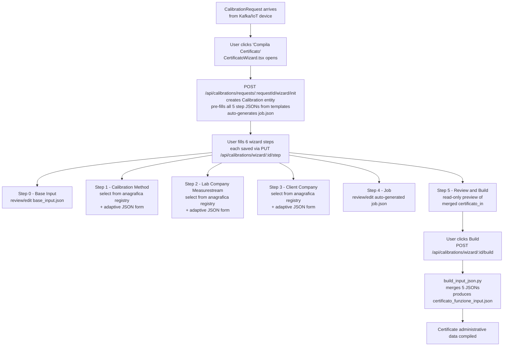
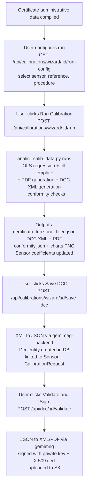

1. CalibrationRequest arrives (from Kafka/IoT device)
        ↓
2. User clicks "Compila Certificato" → CertificatoWizard.tsx opens
        ↓
3. Wizard initialized via POST /api/calibrations/requests/{requestId}/wizard/init
   → CalibrationWizardService.initWizard() creates Calibration entity
   → pre-fills all 5 step JSONs from classpath templates (calibration_templates/)
   → auto-generates job.json from CalibrationRequest data (IDs, dates, sensor info)
        ↓
4. User fills 6 wizard steps → each saved individually via PUT /api/calibrations/wizard/{id}/step

        Step 0 - Base Input: review/edit base_input.json (PDF labels, structural placeholders)
        Step 1 - Calibration Method: select from anagrafica registry + adaptive JSON form
        Step 2 - Lab Company (Measurestream): select from anagrafica registry + adaptive JSON form
        Step 3 - Client Company: select from anagrafica registry + adaptive JSON form
        Step 4 - Job: review/edit auto-generated job.json (order IDs, dates, sensor info, personnel)
        Step 5 - Review & Build: read-only preview of the merged certificato_in output

5. User clicks "Build" → POST /api/calibrations/wizard/{id}/build
   → CalibrationWizardService.buildCertificatoIn() asserts all 5 JSONs present
   → PythonBridgeService invokes: python build_input_json.py --method --client --job --out
   → build_input_json.py merges 5 JSONs → certificato_funzione_input.json (cettificato_in)
   → stored in Calibration.certificatoIn, sets calibrated = true
        ↓
6. User configures run → GET /api/calibrations/wizard/{id}/run-config
   → returns available sensors, references, and procedures for selection
        ↓
7. User clicks "Run Calibration" → POST /api/calibrations/wizard/{id}/run
   → CalibrationRunService.runCalibration() resolves Sensor, creates runs/{runId}/ directory
   → CalibrationRunConfig: sensor model, reference model, procedure, charts, verbose, unit options
   → PythonBridgeService invokes: python analisi_calib_data.py
        --input export.json --sensor <sensor.json> --ref <ref.json>
        --cert-input certificato_in.json --cert-output <out.json> --pdf <out.pdf>
        --xml <out.xml> --conformity-output conformity.json --images-dir <images/>
   → analisi_calib_data.py runs: OLS regression + fills template + generates PDF + generates DCC XML
   → produces: certificato_funzione_filled.json, DCC XML, PDF, conformity.json, calibration charts (PNG)
   → new calibration coefficients written back to Sensor entity (via SensorCoefficientUpdater)
        ↓
8. User clicks "Save DCC" → POST /api/calibrations/wizard/{id}/save-dcc
   → DCC XML converted to JSON via gemimeg-backend (POST /api/v1/dcc/xsd/dcc/json)
   → Dcc entity created in database (linked to Sensor + CalibrationRequest)
        ↓
9. User clicks "Validate & Sign" → POST /api/dcc/{id}/validate
   → DccService.validateDcc(): JSON → XML/PDF via gemimeg
   → DccSigningService.performSigningAndVerification(): signs with private key + X.509 cert
   → signed files uploaded to S3 (hashXml, hashPdf stored)

**Graph 2 — Calibration Run, DCC Save and Signing**

*Continues from: certificatoIn stored, calibrated = true*

