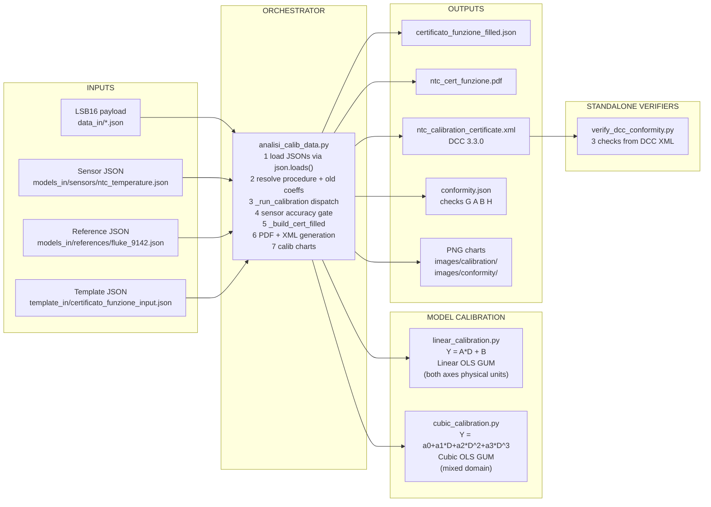

# calibration  —  high-level flow

```mermaid
flowchart LR
    subgraph INPUTS
        LSB["LSB16 payload\ndata_in/*.json"]
        SNJ["Sensor JSON\nmodels_in/sensors/ntc_temperature.json"]
        RFJ["Reference JSON\nmodels_in/references/fluke_9142.json"]
        TMJ["Template JSON\ntemplate_in/certificato_funzione_input.json"]
    end

    subgraph ORCH["ORCHESTRATOR"]
        MAIN["analisi_calib_data.py\n1 load JSONs via json.loads()\n2 resolve procedure + old coeffs\n3 _run_calibration dispatch\n4 sensor accuracy gate\n5 _build_cert_filled\n6 PDF + XML generation\n7 calib charts\n"]
    end

    subgraph MODELS["MODEL CALIBRATION"]
        LIN["linear_calibration.py\nY = A*D + B\nLinear OLS GUM\n(both axes physical units)"]
        CUB["cubic_calibration.py\nY = a0+a1*D+a2*D^2+a3*D^3\nCubic OLS GUM\n(mixed domain)"]
    end

    subgraph OUTPUTS
        FJS["certificato_funzione_filled.json"]
        PDF["ntc_cert_funzione.pdf"]
        XML["ntc_calibration_certificate.xml\nDCC 3.3.0"]
        CNF["conformity.json\nchecks G A B H"]
        CHT["PNG charts\nimages/calibration/\nimages/conformity/"]
    end

    subgraph VERIFIERS["STANDALONE VERIFIERS"]
        DCC["verify_dcc_conformity.py\n3 checks from DCC XML"]
    end

    LSB --> MAIN
    SNJ --> MAIN
    RFJ --> MAIN
    TMJ --> MAIN

    MAIN --> LIN
    MAIN --> CUB

    MAIN --> FJS
    MAIN --> PDF
    MAIN --> XML
    MAIN --> CNF
    MAIN --> CHT

    XML --> DCC
```
