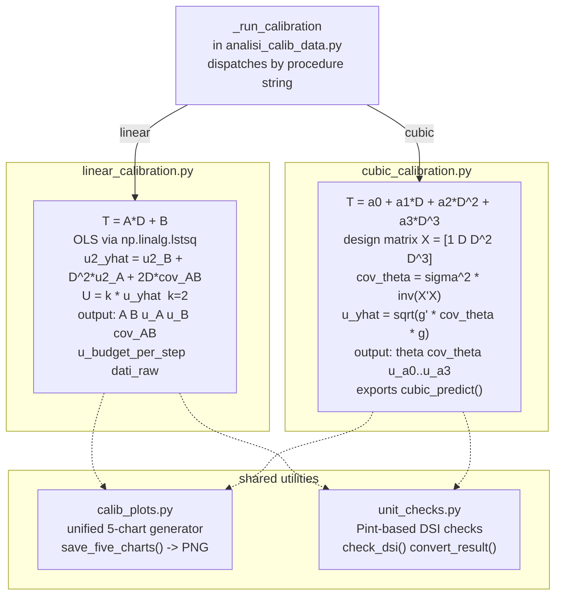

# model calibration  —  submodule detail

### common interface — every model exports

| function | role |
|----------|------|
| `calibrate(payload, lsb_scale, sample_size, adc_max, ub_ref_y, ub_sensor_lsb, ...) -> dict` | runs calibration, returns result dict |
| `save_charts(...) -> list[path]` | saves 5 PNG charts to disk |
| `plot_charts(...)` | interactive matplotlib display |
| `main()` | standalone CLI entry |

### common inputs — all models

| param | value |
|-------|-------|
| `payload` | LSB16 JSON dict, per-step raw samples |
| `lsb_scale_sensor_info` | `{minPhysVal, maxPhysVal}` from sensor JSON |
| `sample_size` | 20 |
| `adc_max` | 65535.0  (16-bit ADC) |
| `ub_ref_y` | ref type-B uncertainty in native Y from ref JSON |
| `ub_sensor_lsb` | sensor type-B uncertainty LSB from sensor JSON |
| `risol` | sensor resolution in Y |
