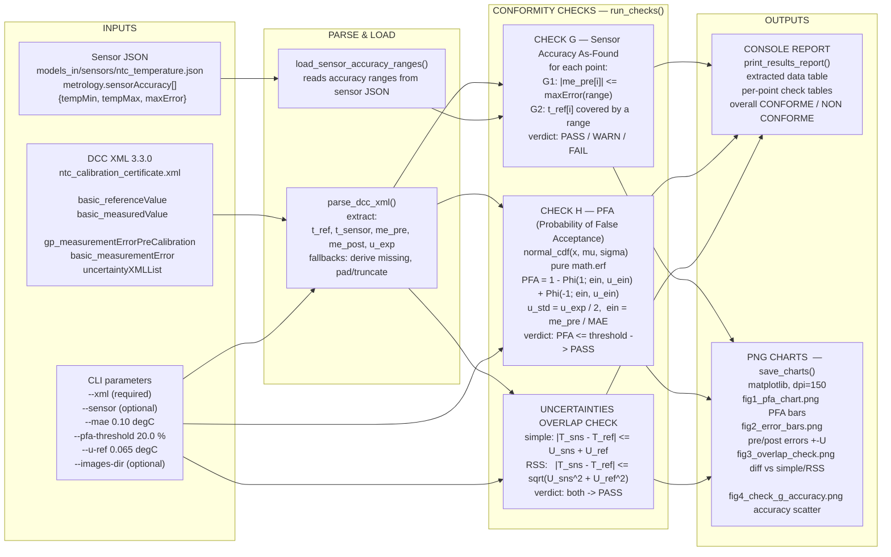

# verify_dcc_conformity  —  high-level flow

```mermaid
flowchart LR
    subgraph INPUTS
        XML["DCC XML 3.3.0\nntc_calibration_certificate.xml\n<quantity refType='...'>\n  basic_referenceValue\n  basic_measuredValue\n  gp_measurementErrorPreCalibration\n  basic_measurementError\n  uncertaintyXMLList"]
        SNJ["Sensor JSON\nmodels_in/sensors/ntc_temperature.json\nmetrology.sensorAccuracy[]\n  {tempMin, tempMax, maxError}"]
        CLI["CLI parameters\n--xml  (required)\n--sensor  (optional)\n--mae  0.10 degC\n--pfa-threshold  20.0 %\n--u-ref  0.065 degC\n--images-dir  (optional)"]
    end

    subgraph PARSE["PARSE & LOAD"]
        PXML["parse_dcc_xml()\nextract:<br/>t_ref, t_sensor, me_pre, me_post, u_exp<br/>fallbacks: derive missing, pad/truncate"]
        PSNJ["load_sensor_accuracy_ranges()\nreads accuracy ranges from sensor JSON"]
    end

    subgraph CHECKS["CONFORMITY CHECKS  —  run_checks()"]
        direction TB
        G["CHECK G — Sensor Accuracy As-Found\nfor each point:<br/>  G1: |me_pre[i]| <= maxError(range)<br/>  G2: t_ref[i] covered by a range<br/>verdict: PASS / WARN / FAIL"]
        H["CHECK H — PFA (Probability of False Acceptance)\nnormal_cdf(x, mu, sigma)  pure math.erf<br/>PFA = 1 - Phi(1; ein, u_ein) + Phi(-1; ein, u_ein)<br/>u_std = u_exp / 2,  ein = me_pre / MAE<br/>verdict: PFA <= threshold -> PASS"]
        OVL["UNCERTAINTIES OVERLAP CHECK\nsimple: |T_sns - T_ref| <= U_sns + U_ref<br/>RSS:   |T_sns - T_ref| <= sqrt(U_sns^2 + U_ref^2)<br/>verdict: both -> PASS"]
    end

    subgraph OUTPUTS
        RPT["CONSOLE REPORT\nprint_results_report()<br/>extracted data table<br/>per-point check tables<br/>overall CONFORME / NON CONFORME"]
        CHT["PNG CHARTS  —  save_charts()\nmatplotlib, dpi=150\n  fig1_pfa_chart.png       PFA bars\n  fig2_error_bars.png      pre/post errors +-U\n  fig3_overlap_check.png   diff vs simple/RSS\n  fig4_check_g_accuracy.png accuracy scatter"]
    end

    XML --> PXML
    SNJ --> PSNJ
    CLI --> PXML

    PXML --> G
    PXML --> H
    PXML --> OVL
    PSNJ --> G
    CLI --> H
    CLI --> OVL

    G --> RPT
    H --> RPT
    OVL --> RPT

    G --> CHT
    H --> CHT
    OVL --> CHT
```
