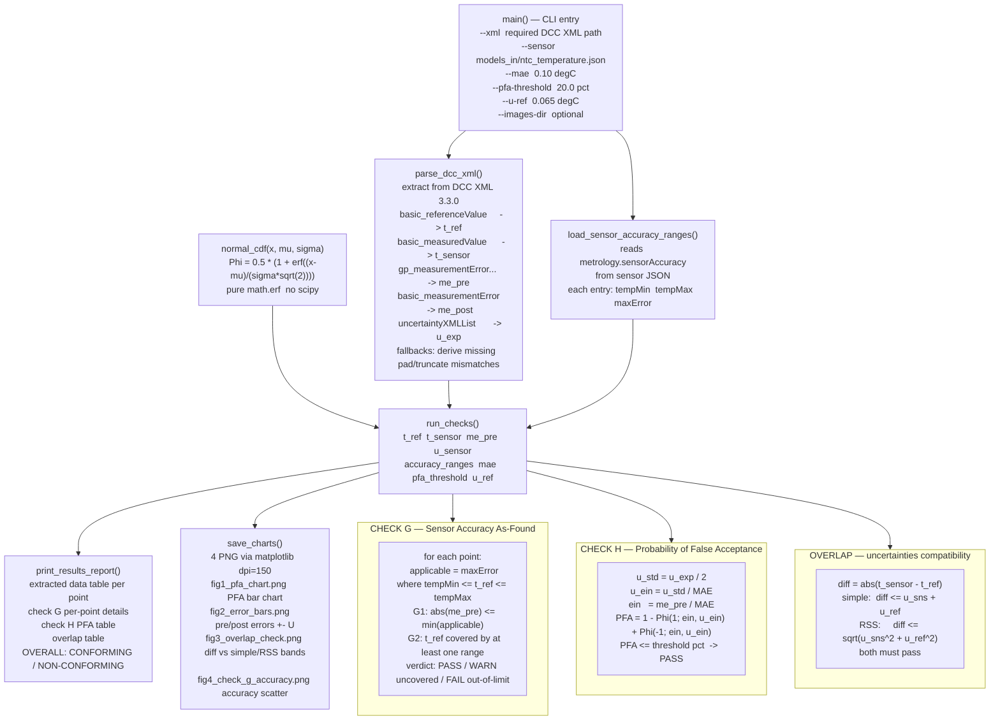

# verify_dcc_conformity.py  —  flow

## formulas

| check | formula |
|-------|---------|
| G | `abs(me_pre) <= maxError(tempMin..tempMax)` |
| H | `PFA = 1 - Phi(1; ein, u_ein) + Phi(-1; ein, u_ein)` |
| H normal cdf | `Phi(x; mu, sigma) = 0.5 * (1 + erf((x - mu) / (sigma * sqrt(2))))` |
| overlap simple | `abs(T_sns - T_ref) <= U_sns + U_ref` |
| overlap RSS | `abs(T_sns - T_ref) <= sqrt(U_sns^2 + U_ref^2)` |
